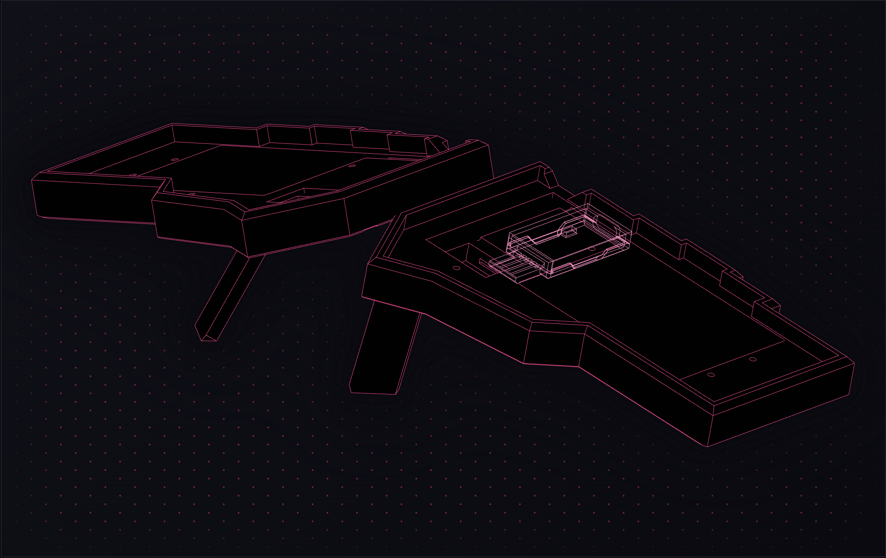

# Board in the Shell ZMK Config (with dongle)

> This repo is a fork of [aroum/zmk-enki42-dongle](https://github.com/aroum/zmk-enki42-dongle). Huge thanks to the original creators, their work is the basis for this repository.

ZMK config for **Board in the Shell**. Uses 3 nRF52840 controllers: one dongle, one left half, one right half. The dongle is the central and the halves are peripherals, which is much better for battery life. See the [ZMK Power Profiler](https://zmk.dev/power-profiler).




Project homepage: https://bits.viscouspotenti.al/
- model files
- full instruction
- one-click firmware build pipeline

The default keymap is **my** daily driver layout, swap it out for your own.

## Building your own firmware

The homepage has a one-click flow that does all of this for you. If you'd rather do it by hand:

### 1. Make a private copy of the repo

GitHub can't make a private fork of a public repo, the fork button always produces a public one. This repo is a template instead, so copy it as a private repo. In the next step you generate secret key material, publish it and anyone can impersonate your keyboard halves.

```
# Needs the GitHub CLI signed in (gh auth login)
gh repo create board-in-the-shell --template ViscousPot/board-in-the-shell --private --clone
cd board-in-the-shell
```

### 2. Generate fresh addresses and bond keys

The firmware ships with pre-shared BLE identities and long-term keys so the dongle and halves boot already paired and skip the SMP handshake entirely. Those shipped values are public, roll your own.

| Macro | Owner | Value |
|---|---|---|
| `PROTEUS_ADDR_DONGLE_INIT` | dongle | static random address |
| `PROTEUS_ADDR_LEFT_INIT` | left half | static random address |
| `PROTEUS_ADDR_RIGHT_INIT` | right half | static random address |
| `PROTEUS_LTK_DONGLE_LEFT_INIT` | dongle + left | 16-byte long-term key |
| `PROTEUS_LTK_DONGLE_RIGHT_INIT` | dongle + right | 16-byte long-term key |

Run from the root of your private clone. It rewrites all five in `config/boards/shields/enki42/proteus_bonds.h`.

```
python3 scripts/regen_bonds.py
```

### 3. Customise your keymap (optional)

Point [keymap-editor](https://nickcoutsos.github.io/keymap-editor/) at your private repo and edit `config/boards/shields/enki42/enki42.keymap` visually. It commits straight back to the repo.

### 4. Push and let Actions build it

`.github/workflows/build.yml` runs on every push and calls ZMK's `build-user-config` workflow. Four targets come out of the matrix in `build.yaml`:

- `board_in_the_shell_dongle.uf2`
- `board_in_the_shell_left.uf2`
- `board_in_the_shell_right.uf2`
- `settings_reset.uf2`

```
git add config/boards/shields/enki42/proteus_bonds.h
git commit -m "Fresh BLE identities and bond keys"
git push
```

### 5. Download the firmware

Open the **Actions** tab of your private repo, click the green run, and download the `firmware` artifact at the bottom of the summary page. Unzip it, the `.uf2` files above are inside.

### 6. Flash all three controllers

Double-tap reset to mount each nRF52840 as a USB drive, then drag the matching `.uf2` onto it.

1. `settings_reset.uf2` onto **all three** controllers first, clearing any stale bonds.
2. Then `board_in_the_shell_dongle`, `board_in_the_shell_left` and `board_in_the_shell_right` onto their respective boards.

If the halves do not connect themselves, try pressing the reset buttons on the dongle and keyboards.

## Credit

* [@aroum](https://github.com/aroum/zmk-enki42-dongle) for the original firmware
